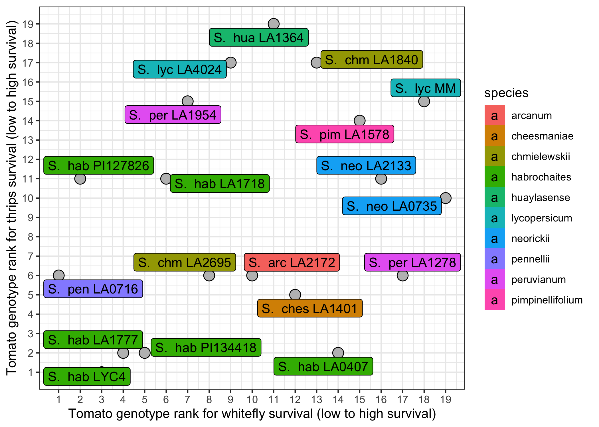
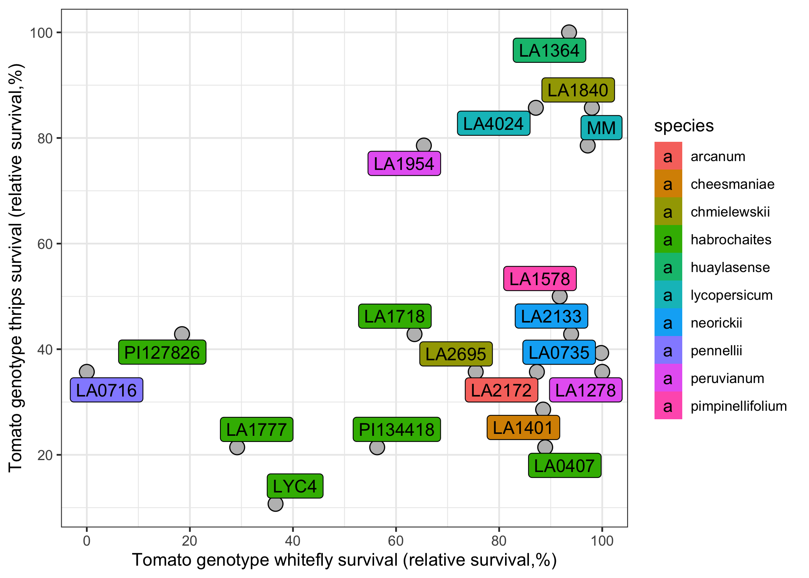
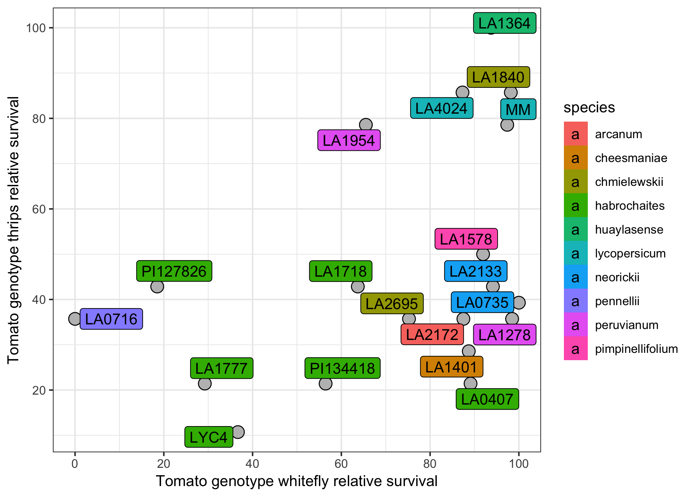

# Figure 2 

## Version 1: based on the ranks

## Version 2: based on the relative percentages (wf % and thrips median survival time)
For whitefly: taking the maximum of the survival percentage (83% becomes 100%).  
For thrips: taking the highest median survival time (14 days becomes 100%).  

## Version 3: based on the relative percentages (wf % and thrips RMST)
RMST stands for Restricted Mean Survival Time and is defined as the area under the curve of the survival function. 

For whitefly: taking the maximum of the survival percentage (83% becomes 100%).  
For thrips: taking the highest RMST (14 days becomes 100%).  

Inspired by this R vignette:  
https://cran.r-project.org/web/packages/survRM2/vignettes/survRM2-vignette3-2.html  

And this Github repository: 
https://github.com/scientific-computing-solutions/RMST

## Data underlying the plots
Can be seen in the [dataframe_for_relative_scatterplots](./dataframe_for_relative_scatterplots.tsv) file. 